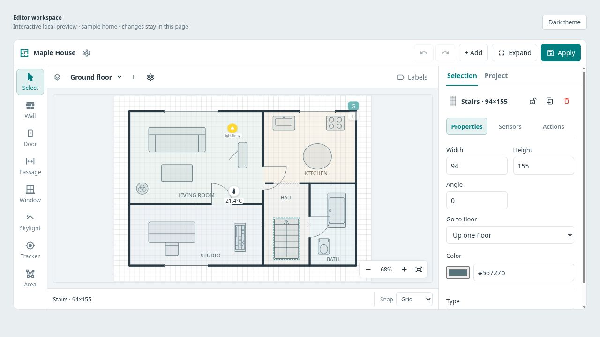
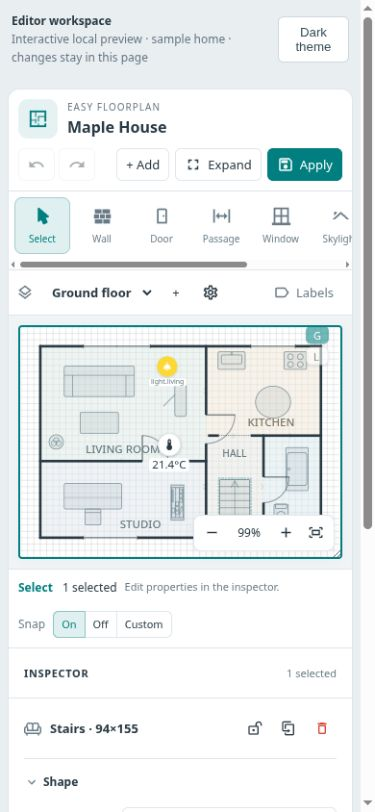
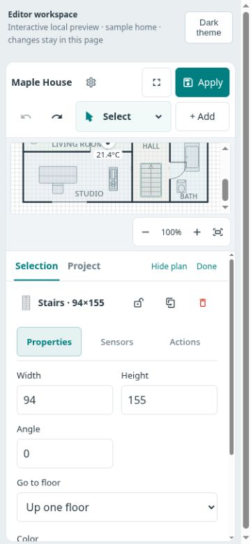
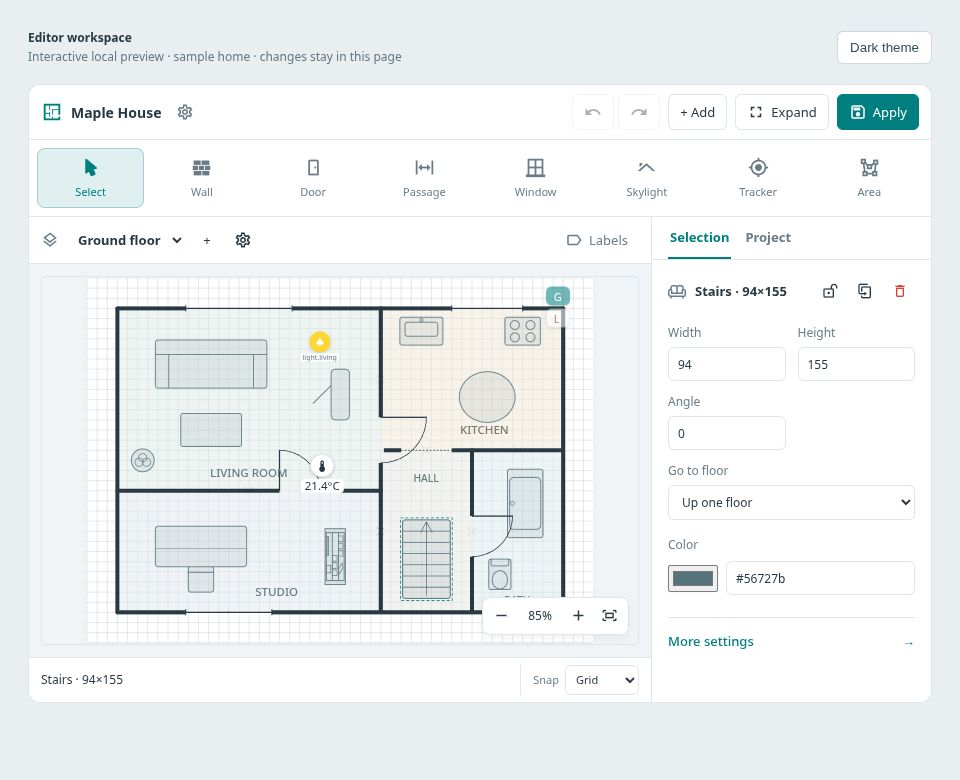
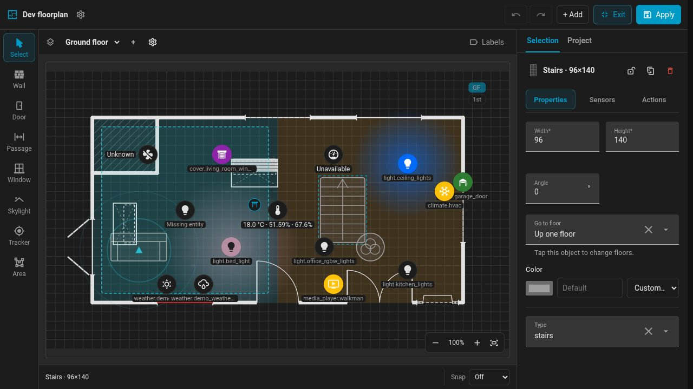

# Editor workspace

The editor keeps the drawing tools, plan and settings together. Select an object
to edit its dimensions and other common properties. The **Selection** inspector
shows labeled tabs for the remaining settings: Sensors or Readings, Style,
Actions and Visibility, as applicable to that object. **Project** opens the plan's
six settings destinations: Plan, Style, View, Lighting, Devices and Symbols.

The desktop screenshot shows the same sample home and selected stairs as the
[previous editor](img/editor-workspace-before.jpg), where the properties were
below the canvas. The [project settings view](img/editor-workspace-project.jpg)
shows all six destinations together. Tabs stay visible while fields scroll;
Left/Right, Home and End move keyboard focus between tabs. **Choose a sensor** on
an unbound opening's Actions page opens Sensors and moves focus to that tab.

## Drawing and zoom

At wide desktop sizes the eight drawing tools sit in a rail beside the plan.
On narrower screens, use the **Drawing tool** picker in the toolbar. **+ Add**
opens devices, text and the furniture library. Undo, redo, Expand and Apply stay
available in the toolbar.

**Fit** fits the full plan within the available canvas width and height. Its
highlight shows that automatic fitting is enabled: changing the editor size or
the plan dimensions fits it again. Zooming or scrolling the plan turns that off
so resizing the workspace keeps your chosen view. Press **Fit** to enable it
again. Extremely tall plans can still need scrolling at the minimum scale.

The zoom percentage is relative to the **canvas width**. At **100% width** the
plan fills that width and a tall plan may extend below the view; clicking the
percentage returns to this scale. Use +/−, Ctrl/Cmd + wheel or a two-finger pinch
to change it. The card's dashboard scale is a separate
[display setting](appearance.md#overlay-scale).

**Snap** applies to placement, dragging and wall drawing. Grid follows the
project's grid step; Off allows free positioning; Custom uses a percentage of
the grid. The visible hint states the resulting distance in canvas units, so
the custom percentage can be understood on a touch screen without a tooltip.

## Phone and tablet

On a phone, **Edit properties** opens the inspector below a live plan preview.
The preview keeps the drawing scale and pans to the selected object. **Hide
plan** gives fields the whole workspace; **Show plan** restores it. **Done**
returns to drawing. The expanded editor follows the available visual viewport
and temporarily hides the preview when the on-screen keyboard opens.

| Drawing | Properties with live preview |
| --- | --- |
|  |  |

Both phone screenshots are 360×780. At tablet widths the inspector sits beside
the plan, with a compact toolbar:

The [short landscape layout](img/editor-workspace-landscape.jpg) also keeps the
plan and inspector side by side, shown at 740×360 with Expand enabled.

## Home Assistant forms

Home Assistant supplies the entity, action and other native selectors. The
standalone preview uses simpler input fallbacks; it cannot apply changes to a
dashboard.

The [native phone inspector](img/editor-workspace-ha-mobile.jpg) shows **Hide
plan** giving those forms more room. These screenshots were captured on
2026-10-03 using Home Assistant 2026.9.2; the zoom and Snap labels have since
been clarified. See the [development guide](../docker/README.md#standalone-editor-preview)
to run the preview and the [native acceptance record](../docker/README.md#native-acceptance-checked-on-2026-10-03)
for what was checked. Physical iOS/Android keyboard and gesture acceptance
remains outstanding.
